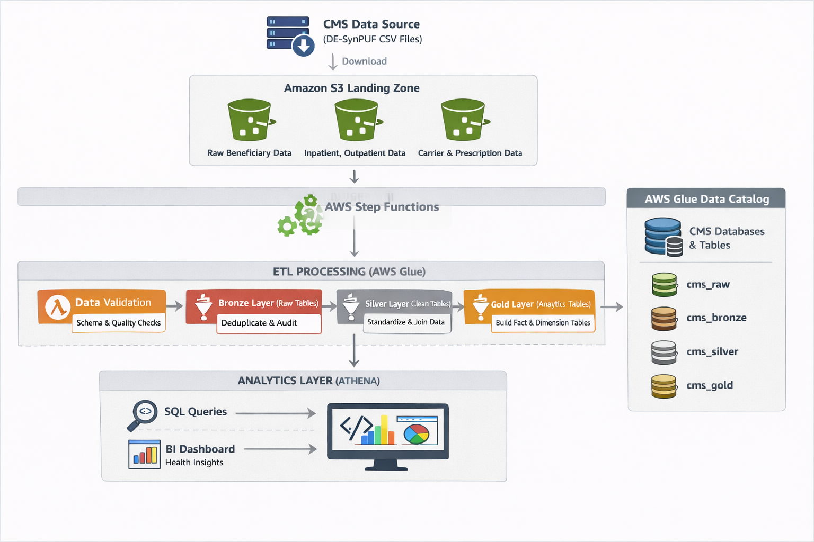
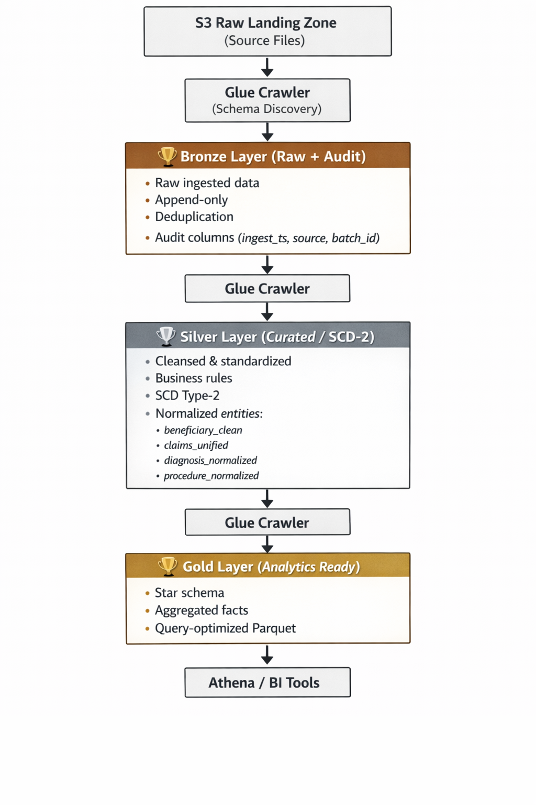

# 🏥 CMS Medicare Claims Data Pipeline (AWS End-to-End)

An end-to-end **cloud-native data engineering pipeline** built on **AWS**, using **CMS Medicare DE-SynPUF** data to demonstrate scalable ingestion, transformation, orchestration, and analytics using modern data lakehouse principles.

---

## 🚀 Project Highlights

* ✅ Real-world **healthcare claims data** (CMS Medicare)
* ✅ **Bronze → Silver → Gold** layered architecture
* ✅ Event-driven orchestration with **AWS Step Functions**
* ✅ Large-scale ETL using **AWS Glue (PySpark)**
* ✅ Dimensional modeling (Facts & Dimensions)
* ✅ Athena-ready analytics layer
* ✅ Production-grade error handling & schema management

This project mirrors how **enterprise healthcare data platforms** are designed in real production environments.

---

## 📊 Dataset Overview

**CMS DE-SynPUF (Synthetic Public Use File)**

* **Source**: Centers for Medicare & Medicaid Services (CMS)
* **Data Type**: De-identified Medicare claims
* **Time Period**: 2008–2010
* **Scale**: ~116,000 beneficiaries (Sample 1)
* **Files Included**:

  * Beneficiary Summary
  * Inpatient Claims
  * Outpatient Claims
  * Carrier Claims
  * Prescription Drug Events
* **Compliance**: HIPAA-safe, synthetic data

🔗 Official dataset:
[https://www.cms.gov/data-research/statistics-trends-and-reports/medicare-claims-synthetic-public-use-files](https://www.cms.gov/data-research/statistics-trends-and-reports/medicare-claims-synthetic-public-use-files)

---

## 🏗️ Architecture Overview

*End-to-end data flow from S3 ingestion to Athena analytics*

### Key AWS Services Used

* **Amazon S3** – Data lake storage
* **AWS Glue** – ETL + Data Catalog
* **AWS Step Functions** – Workflow orchestration
* **AWS Lambda** – Validation & automation
* **Amazon Athena** – SQL analytics
* **Amazon SNS** – Notifications
* **Amazon IAM** – Access Management
* **Amazon Cloudwatch** – Logs and Audit

---

## 🧱 Data Layers Explained

### 🥉 Bronze Layer

* Raw ingestion from S3 landing zone
* Schema inference via Glue Crawlers
* Deduplication & audit columns
* Immutable historical storage

### 🥈 Silver Layer

* Data cleansing & standardization
* Business rules applied
* **SCD Type-2** implementation for Beneficiaries
* Normalized tables:

  * `beneficiary_clean`
  * `claims_unified`
  * `diagnosis_normalized`
  * `procedure_normalized`

### 🥇 Gold Layer

* Analytics-ready dimensional model
* Star schema design
* Optimized for Athena queries

**Dimensions**

* `dim_patient` (SCD-2)
* `dim_provider`
* `dim_diagnosis`
* `dim_date`

**Facts**

* `fact_claims`
* `fact_prescriptions`
* `patient_summary`

---

## 🔄 Orchestration (Step Functions)

The pipeline is orchestrated using **AWS Step Functions**:

1. Data validation (Lambda)
2. Glue Crawlers (raw)
3. Bronze ETL
4. Bronze crawlers (parallel)
5. Silver ETL
6. Silver crawlers (parallel)
7. Gold ETL
8. Gold crawlers (parallel)
9. Data quality checks
10. Success notification (SNS)

Parallel execution is used where possible to improve performance and reduce cost.

---

## 📂 Project Structure
health-data/
├── architecture/          # Architecture diagrams
├── athena_queries/        # Sample analytics queries
├── docs/                  # Documentation
│   ├── SETUP.md
│   ├── ARCHITECTURE.md
│   └── outputs/          # Screenshots
├── glue_jobs/            # PySpark ETL scripts
│   ├── bronze/
│   ├── silver/
│   └── gold/
├── lambda/               # Python Lambda functions
├── step_functions/       # Workflow definitions
├── scripts/              # Utility scripts
└── iam_roles/           # IAM policy documents

---
## 🧪 Data Quality & Reliability

* Schema validation before processing
* Type-safe Spark transformations
* Explicit casting to avoid schema drift
* Referential integrity checks in Gold layer
* Audit columns for lineage tracking

---

## 📈 Pipeline Metrics

| Metric | Value |
|--------|-------|
| **Data Processed** | 788,880 claims |
| **Pipeline Runtime** | ~45 minutes |
| **Bronze Tables** | 5 |
| **Silver Tables** | 4 |
| **Gold Tables** | 7 |
| **Athena Queries** | 15+ sample queries |
| **Total S3 Storage** | ~2 GB |
| **Monthly Cost** | <$10 |

---

## ⚠️ Cost Management Note

This project was intentionally **paused before full-scale reprocessing** to stay within **AWS Free Tier limits**.

> This reflects real-world engineering decisions where cost-awareness is critical.

---

## 💡 Key Challenges Solved

### 1. Schema Drift in Large Datasets
**Problem:** PySpark fails when column types mismatch  
**Solution:** Explicit type casting and schema validation

### 2. SCD Type-2 at Scale
**Problem:** Tracking patient demographic changes over time  
**Solution:** Window functions + incremental merge logic

### 3. Concurrent Glue Job Limits
**Problem:** AWS limits concurrent job runs  
**Solution:** Sequential processing with Step Functions

### 4. Cost Optimization
**Problem:** Glue jobs are expensive  
**Solution:** Partitioning, Snappy compression, bookmarks

---

## 🧠 Key Learnings

* Schema drift is the #1 failure point in large Spark pipelines
* Glue Crawlers require **careful partition strategy**
* SCD Type-2 is non-trivial at scale
* Column ambiguity and type mismatches are common Spark pitfalls
* Parallel orchestration significantly reduces pipeline runtime
* Cost monitoring is as important as performance

---

## 🛠️ Tech Stack

* **Languages**: Python, PySpark, SQL
* **Cloud**: AWS (S3, Glue, Lambda, Step Functions, Athena)
* **Data Modeling**: Star Schema, SCD-2
* **Orchestration**: Step Functions

---

## 🆚 Why This Project Stands Out

| Feature | This Project | Typical Portfolio Projects |
|---------|-------------|---------------------------|
| **Data Volume** | 788K+ real claims | Usually <10K synthetic |
| **Layers** | Bronze → Silver → Gold | Often single-layer |
| **Orchestration** | Step Functions | Manual scripts |
| **Error Handling** | Production-grade | Basic try/catch |
| **Cost Awareness** | Documented | Rarely mentioned |
| **Real Dataset** | CMS Medicare | Made-up data |

---

## 📌 Future Enhancements

* Add CI/CD for Glue jobs
* Integrate dbt for Gold modeling
* Implement Great Expectations for DQ
* Add QuickSight dashboards
* Enable incremental processing with bookmarks

---

## 👤 Author

**Sneha George Gnanakalavathy**
Data Engineer | Data Scientist
📍 United Kingdom

🔗 Portfolio: [https://snehageorge22.github.io](https://snehageorge22.github.io)
🔗 LinkedIn: [https://www.linkedin.com/in/snehageorge](https://www.linkedin.com/in/snehageorge)
🔗 GitHub: [https://github.com/snehageorge22](https://github.com/snehageorge22)
